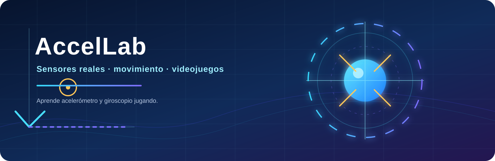
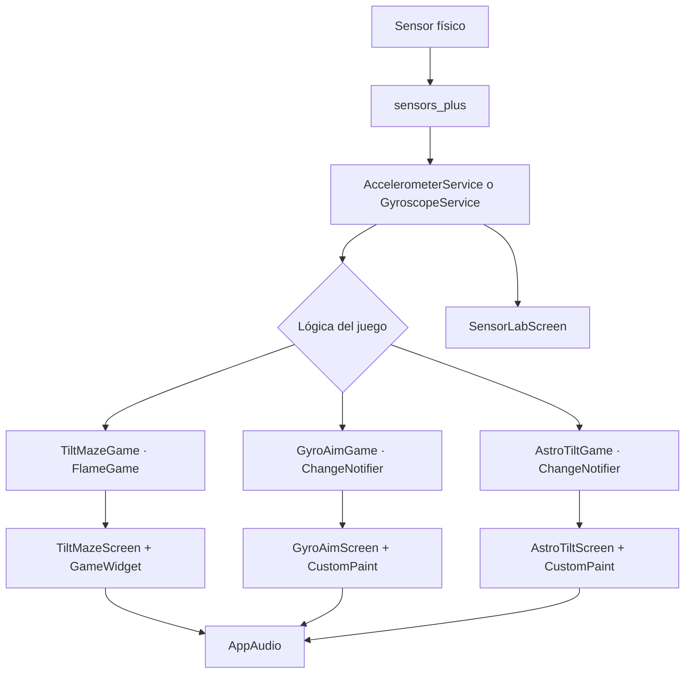

<div align="center">
  
  <h1>AccelLab</h1>
  <p><strong>Aprende acelerómetro y giroscopio jugando.</strong></p>
  <p>Laboratorio interactivo desarrollado en Flutter para explorar sensores de movimiento mediante lecturas en tiempo real y minijuegos controlados físicamente.</p>
  <p>
    
  </p>
</div>

<p align="center">
  <a href="https://flutter.dev"></a>
  <a href="https://dart.dev"></a>
  <a href="https://developer.android.com"></a>
  <a href="https://pub.dev/packages/sensors_plus"></a>
  <a href="https://pub.dev/packages/flame"></a>
  <a href="https://pub.dev/packages/audioplayers"></a>
  
</p>

<p align="center">
  <a href="#presentacion">Presentación</a> ·
  <a href="#juegos">Juegos</a> ·
  <a href="#laboratorio-de-sensores">Laboratorio</a> ·
  <a href="#arquitectura">Arquitectura</a> ·
  <a href="#instalacion">Instalación</a> ·
  <a href="#documentacion">Documentación</a>
</p>

<a id="presentacion"></a>
## Presentación

AccelLab es una aplicación educativa para una exposición universitaria de Programación Móvil. Su propósito es convertir conceptos que suelen explicarse de forma abstracta —aceleración, velocidad angular, ejes y calibración— en observaciones y decisiones visibles dentro de una interfaz Flutter.

La aplicación está dirigida a estudiantes y visitantes que quieran experimentar con sensores de movimiento usando un teléfono real. El laboratorio muestra lecturas X, Y y Z en tiempo real; los videojuegos convierten esas lecturas en movimiento, puntería y navegación. Balance Master permanece en el código y en sus pruebas, pero no forma parte del catálogo principal.

## Características principales

| Área | Implementación comprobada |
| --- | --- |
| Laboratorio | Lecturas X, Y y Z del acelerómetro en m/s² y del giroscopio en rad/s, con estado de espera y errores de lectura. |
| Juegos | Tilt Maze, Gyro Aim y AstroTilt aparecen en el selector principal. Cada juego identifica el sensor que utiliza. |
| Control | Calibración, zona muerta, suavizado, sensibilidad, recentrado, pausa y control táctil alternativo donde el juego lo implementa. |
| Ciclo de vida | Las pantallas cancelan sus suscripciones y cierran sus servicios al salir; los juegos pausan al pasar a segundo plano. |
| Audio | `AppAudio` centraliza una pista de música y efectos reutilizados por los juegos. Los archivos están en `assets/audio/`. |
| Plataformas | El proyecto contiene Android, iOS, web y Windows. En este entorno se verificaron el análisis, las pruebas y la compilación APK de Android; la validación física de sensores en iOS, web y Windows queda pendiente. |
| Funcionamiento sin conexión | La aplicación usa recursos locales y no implementa backend ni autenticación. La experiencia con sensores debe comprobarse en un dispositivo compatible. |

<a id="juegos"></a>
## Juegos

No hay capturas reales de gameplay versionadas en el repositorio. `assets/images/Logo.png` es el logo oficial de la aplicación; el banner de esta página es un recurso documental. Las capturas de las siete vistas sugeridas se pueden incorporar posteriormente en `docs/media/` sin presentar imágenes ficticias como reales.

| Juego | Sensor | Mecánica principal | Documentación |
| --- | --- | --- | --- |
| **Tilt Maze** | Acelerómetro | Guía una esfera por tres pistas, activa checkpoints en orden, atraviesa hielo y evita láseres hasta llegar al portal. | [Guía de juegos](docs/JUEGOS.md#tilt-maze) |
| **Gyro Aim** | Giroscopio | Calibra el sesgo, mueve una mira con velocidad angular, apunta a objetivos y dispara durante una ronda de 30 segundos. | [Guía de juegos](docs/JUEGOS.md#gyro-aim) |
| **AstroTilt** | Acelerómetro | Pilota una nave, esquiva enemigos y meteoritos, recoge mejoras, dispara automáticamente y enfrenta un jefe en la tercera misión. | [Guía de juegos](docs/JUEGOS.md#astrotilt) |

### Tilt Maze

Tilt Maze usa el `AccelerometerService` para leer los ejes X e Y. La calibración guarda la postura neutral y la lógica aplica signos explícitos, zona muerta, suavizado, fricción y un límite de velocidad. El control táctil está disponible como modo alternativo.

Los tres niveles se construyen desde `TiltMazeLevel`: el primero enseña el control, el segundo añade hielo y un láser, y el tercero estrecha la pista y combina dos zonas de hielo con dos láseres. Los checkpoints solo se validan en orden. Una caída inicia una animación y devuelve la esfera al último checkpoint válido; el portal solo completa el nivel cuando todos los checkpoints requeridos fueron activados.

### Gyro Aim

Gyro Aim utiliza `gyroscopeEventStream()` mediante `GyroscopeService`. El juego no interpreta el giroscopio como un ángulo absoluto: integra la velocidad angular con el tiempo. En orientación vertical, el eje Y mueve la mira horizontalmente y el eje X la mueve verticalmente, con signos definidos explícitamente en la lógica.

Al iniciar una ronda se toman lecturas con el teléfono quieto para calcular el sesgo. La sensibilidad se puede ajustar entre 0.4 y 2.4, existe una zona muerta contra el ruido, se suaviza la respuesta y el botón **Centrar mira** devuelve la mira al centro. La partida dura 30 segundos; cada acierto suma 10 puntos y la pantalla de resultados muestra aciertos, disparos y precisión. El disparo reutiliza `laser shot game sfx.mp3` y la ronda usa una pista local de AstroTilt.

### AstroTilt

AstroTilt controla una nave con el acelerómetro, con calibración de la postura neutral, zona muerta, suavizado, inercia ligera y límites por nivel. El control táctil se puede activar como alternativa cuando el sensor no está disponible o se quiere probar el juego sin inclinar el teléfono.

La primera misión presenta enemigos básicos y disparo automático. La segunda aumenta el tráfico y habilita mejoras como drones, disparo triple y misiles. La tercera añade más presión y un jefe con fases de disparo; el nivel solo termina con victoria cuando se cumple la condición del jefe. Las mejoras, efectos de disparo, música, victoria y derrota pasan por `AppAudio`.

<a id="laboratorio-de-sensores"></a>
## Laboratorio de sensores

El laboratorio abre desde el catálogo principal y mantiene una suscripción independiente para cada sensor.

### Acelerómetro

El acelerómetro informa aceleración en los ejes X, Y y Z. La lectura puede incluir la gravedad, por lo que un teléfono quieto no necesariamente muestra cero. La unidad utilizada por la interfaz es **m/s²**. Por ejemplo, si el dispositivo está quieto y la gravedad queda principalmente sobre Z, es esperable observar un valor cercano a 9.81 m/s² en ese eje; la distribución cambia con la orientación.

### Giroscopio

El giroscopio informa **velocidad angular**, no un ángulo absoluto. La unidad es **rad/s**. Un valor positivo en X, Y o Z indica el sentido definido por la plataforma para la rotación alrededor de ese eje. Gyro Aim integra estas lecturas durante intervalos pequeños y limita el intervalo para evitar saltos al regresar del segundo plano.

## Tecnologías utilizadas

| Tecnología | Uso | Versión comprobada |
| --- | --- | --- |
| Aplicación | `versionName` y `versionCode` declarados en `pubspec.yaml`. | 1.0.0+1 |
| Flutter | Interfaz, ciclo de vida y empaquetado multiplataforma. | 3.47.2, canal stable |
| Dart | Lenguaje de la aplicación. | 3.13.2 |
| `sensors_plus` | Streams de acelerómetro y giroscopio. | Declarada `^7.0.0`; resuelta a 7.1.0 |
| Flame | Motor y `GameWidget` de Tilt Maze y Balance Master. | 1.38.2 |
| `audioplayers` | Música en bucle y efectos de audio locales. | 6.8.1 |
| Material Flutter | Navegación, tarjetas, HUD, controles y temas. | SDK de Flutter |

No se utiliza Forge2D ni un backend remoto. Los datos de sensores se procesan localmente.

<a id="arquitectura"></a>
## Arquitectura

La aplicación separa la adquisición del sensor de la lógica de cada juego. Los servicios convierten los eventos de `sensors_plus` en modelos pequeños y testeables. Las pantallas conectan esos modelos con la interfaz y gestionan el ciclo de vida.



`main.dart` crea `AccelLabApp`, cuyo inicio es `GameHubScreen`. El catálogo abre los selectores de niveles de Tilt Maze y AstroTilt, la pantalla de Gyro Aim y el laboratorio. Las pantallas de juego son dueñas de sus suscripciones, tickers o instancias Flame y las cierran en `dispose`.

<a id="instalacion"></a>
## Instalación

### Requisitos

- Flutter 3.47.2 estable y Dart 3.13.2, según el SDK usado para esta auditoría.
- Android Studio/Android SDK para compilar Android. La compilación local resolvió minSdk 24 y targetSdk 36 mediante la configuración actual de Flutter.
- Un teléfono con acelerómetro y/o giroscopio para validar la experiencia física.
- Depuración USB activada si se usa Android físico.

### Clonar y ejecutar

```powershell
git clone https://github.com/Pavel2020123/juegos_acelerometro.git
cd juegos_acelerometro
flutter pub get
flutter devices
flutter run
```

En este equipo Windows, el SDK instalado bajo `C:\Users\LENOVO 14ALC6\Documents\flutter` provoca que el hook de activos nativos de `objective_c` intente ejecutar una ruta truncada en `C:\Users\LENOVO`. Para este checkout se verificó el SDK corto `C:\flutter_sdk`; los comandos reproducibles son:

```powershell
C:\flutter_sdk\bin\flutter.bat pub get
C:\flutter_sdk\bin\flutter.bat devices
C:\flutter_sdk\bin\flutter.bat run -d <id-del-dispositivo>
```

La ruta corta es una solución específica de este entorno. No es necesario mover instalaciones ni modificar variables del sistema para trabajar en otra máquina; allí se debe usar la ruta real del SDK disponible y confirmar `flutter doctor -v`.

### Generar APK de depuración

```powershell
C:\flutter_sdk\bin\flutter.bat build apk --debug
```

El APK de depuración se genera bajo `build/app/outputs/flutter-apk/`. El proyecto conserva una configuración de release con firma de depuración para pruebas locales; ese artefacto no debe presentarse como publicación de tienda.

## Descargar AccelLab

La aplicación todavía no tiene una versión oficial publicada en GitHub Releases. La sección de releases del repositorio está vacía, por lo que no se incluye un enlace ficticio ni se presenta el APK de depuración como descarga pública.

Consulta la página cuando exista una publicación real: [GitHub Releases](https://github.com/Pavel2020123/juegos_acelerometro/releases).

## Código QR

El QR queda pendiente hasta disponer de una URL pública y estable que apunte a un release real. Cuando exista:

1. Publicar el APK mediante GitHub Releases.
2. Comprobar que el enlace descarga el archivo correcto.
3. Generar el QR a partir de esa URL estable.
4. Añadir la imagen a `assets/readme/` y enlazarla desde esta sección.

No se genera un QR con rutas locales, enlaces temporales o archivos que todavía no estén publicados.

## Pruebas y calidad

La validación local registrada para esta documentación es:

```text
dart format lib test       -> correcto, sin archivos pendientes de formato
flutter analyze            -> No issues found!
flutter test               -> All tests passed! (51 pruebas)
flutter build apk --debug  -> compilación correcta en el SDK corto
```

Las pruebas automatizadas cubren niveles, física, checkpoints, pausa, ciclo de vida, calibración, sensibilidad, combate, resultados, catálogo y streams simulados. La comprobación de signos de los ejes, audio y respuesta física debe repetirse en un teléfono real antes de una exposición. No existe una suite `integration_test/` ni un workflow de GitHub Actions que permita publicar un badge de CI.

Consulta el detalle en [docs/PRUEBAS.md](docs/PRUEBAS.md).

## Estructura del proyecto

```text
assets/
├── audio/                  # Música y efectos locales
├── images/                 # Logo oficial usado por la app
└── readme/                 # Recursos gráficos de esta documentación
docs/                       # Arquitectura, sensores, juegos, instalación y pruebas
lib/
├── core/
│   ├── audio/              # AppAudio
│   ├── sensors/            # Servicios de acelerómetro y giroscopio
│   └── theme/              # Tema y colores
├── games/
│   ├── astro_tilt/         # Nave, niveles y HUD
│   ├── balance_master/     # Código legado fuera del catálogo
│   ├── gyro_aim/           # Mira, integración y resultados
│   └── tilt_maze/          # FlameGame, niveles y obstáculos
├── screens/sensor_lab/     # Laboratorio de lecturas X/Y/Z
├── app_logo.dart           # Widget del logo oficial
├── game_hub_screen.dart    # Catálogo principal
└── main.dart               # Punto de entrada
test/                       # Unitarias, widgets y lógica de los juegos
```

<a id="documentacion"></a>
## Documentación

| Documento | Contenido |
| --- | --- |
| [Arquitectura](docs/ARQUITECTURA.md) | Organización, flujo de datos, estado y ciclo de vida. |
| [Acelerómetro](docs/ACELEROMETRO.md) | Ejes, gravedad, unidades, servicio y uso en los juegos. |
| [Giroscopio](docs/GIROSCOPIO.md) | Velocidad angular, integración, calibración, deriva y Gyro Aim. |
| [Juegos](docs/JUEGOS.md) | Reglas, controles, estados, archivos y pruebas de cada juego activo. |
| [Instalación](docs/INSTALACION.md) | Entorno, ejecución, APK y solución de problemas de Windows. |
| [Pruebas](docs/PRUEBAS.md) | Estrategia, resultados ejecutados y validaciones pendientes. |
| [Guía de exposición](docs/GUIA_EXPOSICION.md) | Guion académico y lista de comprobación para presentar la app. |

## Recursos visuales

- El logo oficial de la aplicación es `assets/images/Logo.png`, el mismo archivo que utiliza `AppLogo` en Flutter.
- `assets/readme/accellab-banner.svg` es un banner documental vectorial creado para esta página; no sustituye el logo de la aplicación.
- No hay capturas reales de las pantallas de juego en el repositorio. Se deben tomar en un dispositivo y añadir con rutas relativas antes de presentar una galería.

## Autores y contexto académico

AccelLab es un proyecto académico de **Programación Móvil** de la **Universidad Popular del Cesar**.

- Pavel David Cañas Díaz
- Moisés David Franco Villero
- Luis Francisco Castrillo Navarro

Repositorio: [Pavel2020123/juegos_acelerometro](https://github.com/Pavel2020123/juegos_acelerometro).

## Licencia

La auditoría no encontró un archivo `LICENSE`, `COPYING` ni una declaración de licencia explícita. Por ese motivo, el proyecto no se presenta como MIT, Apache u otra licencia de código abierto. La licencia debe definirse por los autores antes de distribuir el código públicamente.

## Pendientes conocidos

- Capturas reales de la pantalla principal, laboratorio, tres juegos y resultados de Gyro Aim.
- Validación manual de sensores, orientación de ejes y audio en el teléfono que se usará en la exposición.
- Publicación de un APK firmado mediante GitHub Releases.
- Código QR generado a partir de esa publicación real.
- Definición de la licencia del repositorio.
