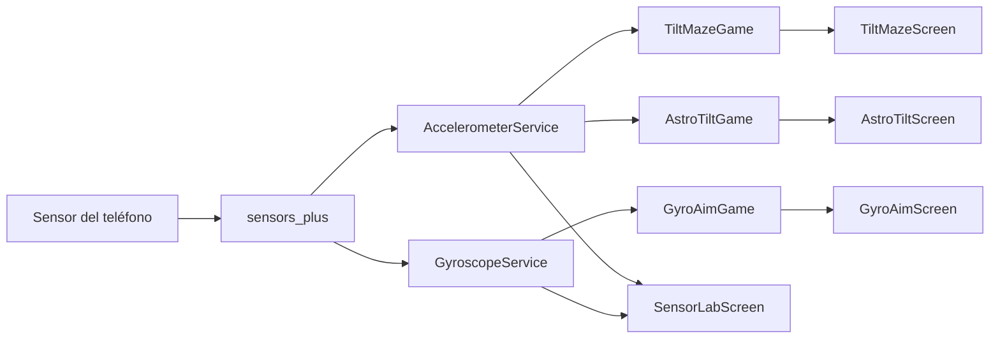
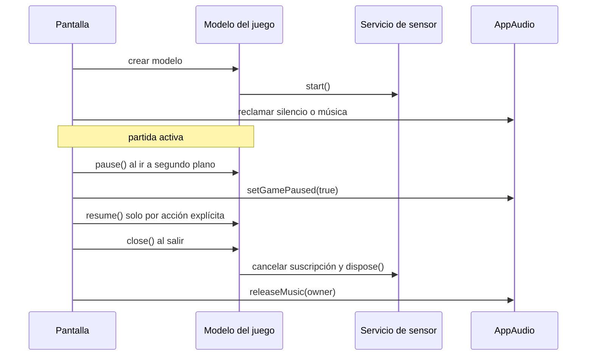

# Arquitectura de AccelLab

Este documento describe la organización que existe en el repositorio. La aplicación es un proyecto Flutter/Dart sin backend: los sensores, la simulación de los juegos, la interfaz y los recursos de audio se ejecutan localmente.

## Capas que existen

| Capa | Archivos principales | Responsabilidad |
| --- | --- | --- |
| Entrada | `lib/main.dart` | Crea `AccelLabApp`, configura Material y abre `GameHubScreen`. |
| Catálogo | `lib/game_hub_screen.dart` | Muestra los tres juegos activos y abre sus selectores o pantallas. También abre el laboratorio. |
| Navegación | `*_level_select_screen.dart` | Presenta los tres niveles de Tilt Maze y AstroTilt y crea la pantalla del nivel elegido. |
| Servicios | `lib/core/sensors/` | Encapsula los streams de acelerómetro y giroscopio y los convierte en modelos de lectura. |
| Estado de juego | `lib/games/*/*_game.dart` | Procesa sensores, tiempo, física, colisiones, objetivos, puntuación y fases. |
| Interfaz | `lib/games/*/*_screen.dart` | Conecta el estado con widgets, `GameWidget`, `CustomPaint`, controles y overlays. |
| Audio | `lib/core/audio/audio_service.dart` | Gestiona una pista musical compartida y reproductores reutilizables para efectos. |
| Presentación de sensores | `lib/screens/sensor_lab/sensor_lab_screen.dart` | Se suscribe a ambos servicios y muestra X, Y y Z con unidades. |

Balance Master mantiene una implementación propia en `lib/games/balance_master/` y sus pruebas, pero `GameHubScreen` ya no lo presenta como juego activo.

## Punto de entrada y navegación

`main.dart` ejecuta `AccelLabApp`. El `MaterialApp` usa `AppTheme.light`, oculta la banda de depuración y establece `GameHubScreen` como pantalla inicial.

El catálogo crea rutas anónimas con `MaterialPageRoute`:

```text
GameHubScreen
├── TiltMazeLevelSelectScreen
│   └── TiltMazeScreen(level)
├── GyroAimScreen
├── AstroTiltLevelSelectScreen
│   └── AstroTiltScreen(level)
└── SensorLabScreen
```

Cada selector tiene un botón de regreso. Las pantallas de juego liberan recursos al hacer `dispose`, por lo que volver al catálogo no debe dejar una suscripción de sensor ni un ticker activo.

## Flujo de datos de los sensores



### Acelerómetro

`AccelerometerService` abre `accelerometerEventStream()`, calcula la magnitud euclídea y publica `AccelerometerReading` con `x`, `y`, `z` y `magnitude`. Tilt Maze y AstroTilt se suscriben con sus propios listeners, de modo que cada juego controla el momento en que procesa la lectura.

### Giroscopio

`GyroscopeService` abre `gyroscopeEventStream(samplingPeriod: ...)` y publica `GyroscopeReading`. El modelo conserva X, Y, Z y el timestamp opcional. Gyro Aim calcula el intervalo con un `Stopwatch` monotónico y no usa el timestamp para convertirlo en un ángulo absoluto.

## Estado de cada juego

### Tilt Maze

`TiltMazeGame` hereda de `FlameGame`. Flame actualiza y renderiza la escena; el estado del HUD se comunica mediante `ValueNotifier<TiltMazeHudState>`, mientras que `currentReading` y `sensorAvailable` exponen la telemetría del sensor.

El nivel se modela con `TiltMazeLevel`: puntos normalizados de la pista, índices de checkpoints, ancho relativo, zonas de hielo y configuraciones de láser. Al cambiar el tamaño de la vista, el juego programa una reconstrucción después del frame para no mutar componentes durante el layout.

### Gyro Aim

`GyroAimGame` hereda de `ChangeNotifier`. `GyroAimScreen` crea un `Ticker` y llama a `update(delta)`; el juego publica los cambios para que `AnimatedBuilder` pinte la mira, el objetivo, el HUD y los overlays.

La fase controla qué operaciones son válidas:

```text
intro -> calibrating -> playing -> results
                         │   └──> paused -> playing
                         └──────> error
```

El listener del giroscopio se crea al comenzar una ronda. Durante la pausa la suscripción puede seguir recibiendo eventos, pero la fase pausada los ignora y el intervalo se reinicia al reanudar. El listener se cancela al terminar, entrar en error o ejecutar `close`.

### AstroTilt

`AstroTiltGame` también es un `ChangeNotifier` actualizado por un `Ticker` de su pantalla. Mantiene listas de enemigos, proyectiles, meteoritos, mejoras, drones, explosiones y un jefe opcional.

Sus fases son `calibrating`, `countdown`, `playing`, `paused`, `victory` y `defeated`. El tiempo se procesa en pasos de como máximo 0.05 s para que una actualización grande no salte toda la simulación. La partida solo avanza en `playing`.

## Audio

`AppAudio` es un singleton con un reproductor musical y un reproductor reutilizable por tipo de efecto. Los owners de música se almacenan en orden; la pantalla que reclama la pista más recientemente visible gana el canal. `setGamePaused` y `setAppActive` pausan la música y detienen efectos cortos cuando corresponde.

Los juegos emiten eventos de audio desde su modelo (`TiltMazeAudioEvent`, `GyroAimAudioEvent` y `AstroAudioEvent`). Las pantallas traducen esos eventos a `AppSound`, manteniendo la lógica de juego independiente de `audioplayers`.

## Ciclo de vida y limpieza



La pantalla de Tilt Maze cierra el juego Flame y sus notifiers; Gyro Aim y AstroTilt cancelan el listener y liberan su servicio. El laboratorio cancela por separado las suscripciones del acelerómetro y del giroscopio y dispone ambos servicios.

## Decisiones técnicas

- Los servicios de sensores son pequeños y testeables; no exponen directamente objetos de plataforma a la interfaz.
- Tilt Maze conserva Flame porque necesita componentes, `GameWidget`, colisiones geométricas y actualización de escena.
- Gyro Aim y AstroTilt usan `ChangeNotifier` y dibujo Flutter porque su estado es una simulación 2D controlada por un ticker.
- La calibración guarda una referencia neutral por ronda y reinicia velocidad o filtros para evitar saltos.
- Los intervalos de integración se limitan y se descartan lecturas durante pausa para evitar acumulación al volver al primer plano.
- Los assets de audio se centralizan en `AppAudio`; no se crean players por frame.
- No hay persistencia, cuentas, red, base de datos ni backend.

## Riesgos y límites documentados

- La orientación de ejes depende del dispositivo y debe comprobarse en hardware físico.
- El acelerómetro puede incluir gravedad y el giroscopio acumula deriva cuando se integra.
- Los tests usan streams simulados; no sustituyen la comprobación de sensores, audio y rendimiento en el teléfono de la exposición.
- El soporte de iOS, web y Windows está presente en el proyecto, pero esta auditoría se validó principalmente con Android y pruebas locales.
